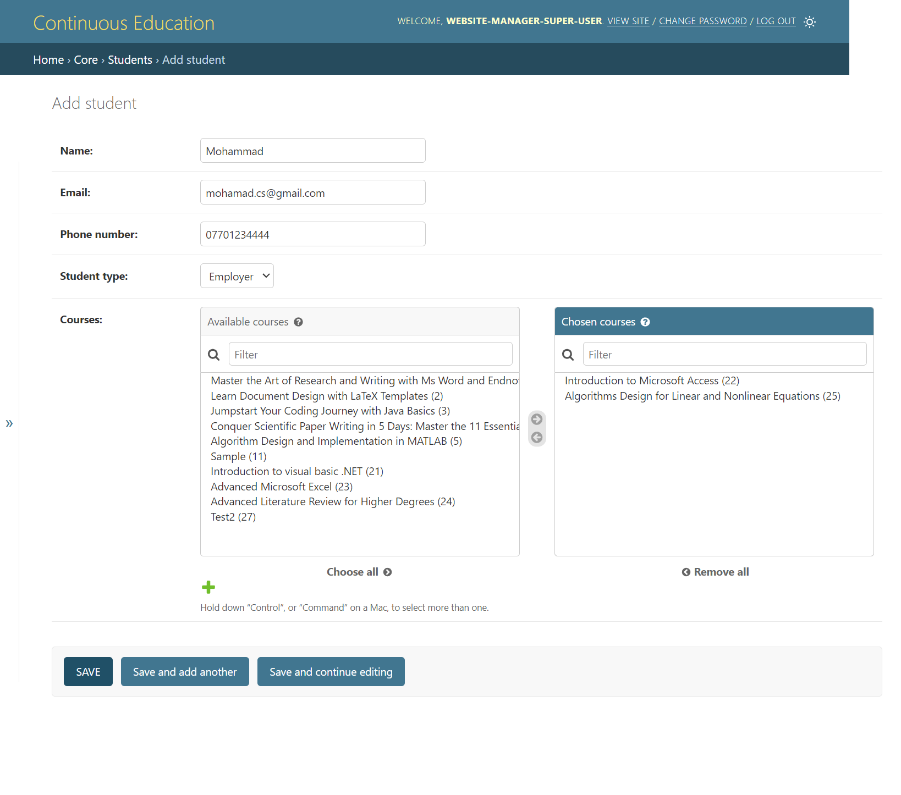

# Continuous Teaching Platform

## Overview

This project provides a web-based platform for managing and accessing continuous teaching courses at Al-Nahrain University's College of Science. It replaces a previously manual system, offering improved efficiency, communication, and accessibility for both faculty and students.

## Features

- **Course Management:** Browse and search available courses, complete with descriptions, schedules, prerequisites, instructor details, dates, and prices.
- **Lecturer Profiles:** View information about instructors, including their qualifications and areas of expertise, with links to their CVs.
- **User-Friendly Interface:**  Intuitive navigation and design for both students and faculty.
- **Centralized Information:** All course-related data is accessible from a single, convenient location.
- **Administrative Dashboard:** Enables efficient course and user management by administrators.
- **Responsive Design:**  Accessible from various devices (desktops, tablets, smartphones) with an optimal viewing experience.

## Technologies Used

- **Front-End:** HTML, CSS 
- **Back-End:** Python, Django
- **Database:** SQLite

## Installation

1. Clone the repository: `git clone https://github.com/your-username/continuous-teaching-platform.git`
2. Navigate to the project directory: `cd continuous-teaching-platform`
3. Create and activate a virtual environment (recommended):
   python -m venv env
   source env/bin/activate

Install dependencies: pip install -r requirements.txt
Apply database migrations: python manage.py migrate
Start the development server: python manage.py runserver

## Usage
Access the platform through your web browser at http://127.0.0.1:8000/.
Students can browse courses, view lecturer profiles.
Lecturers can log in to manage their courses and profile information.
Administrators have access to a dashboard for managing lecturers, courses, and system settings.

## Screenshots

